# Projeto `Colonizadores Espaciais`

# Descrição Resumida do Jogo
O jogo é formado por um tabuleiro com 16 planetas e é jogado por duas pessoas.
Existem os itens: nave de guerra, nave colonizadora e satélite e os recursos: metal,
munição e combustível.
O jogo começa com cada jogador em um planeta aleatório, com uma nave colonizadora e
um satélite nele.
A cada rodada, os jogadores têm sua vez e podem optar por se mover para um planeta ou
construir um item (se tiver recursos disponíveis). Se se moverem para um planeta com nave
inimiga, haverá uma luta, sendo a ordem de força satélite>nave de guerra> nave
colonizadora respeitada. Após as jogadas, é sorteado dois planetas, que oferecem os
recursos que possuem para o jogador que está nele. Quanto mais planeta o jogador
colonizar, mais chances tem de ganhar mais recursos.
Ganha o jogador que fizer 12 pontos primeiro (cada item construído
# Equipe
* `Jéssica  Da Silva De Oliveira` - `RA173931`
* `Gabriel Lima Luz` - `RA177836`

# Vídeos do Projeto

## Vídeo da Prévia

## Vídeo do Jogo
> COLOCAR LINK DE VÍDEO COM O JOGO

# Slides do Projeto

## Slides da Prévia
[`Slides`](mediasDoProjeto/ColonizadoresEspaciaisSlides.pdf)

## Slides da Apresentação Final
`colocar link da apresentacao final`

## Relatório de Evolução

> A maior dificuldade encontrada foi pensar em uma arquitetura para o projeto que envolvesse a interface gráfica, pois não tínhamos conhecimento de como ela funcionava e não sabíamos como montar seu planejamento.
> Inicialmente havia uma única classe View, que se comunicava com o Controlador, o que gerava problemas. Pois o controlador atualizava diretamente a View.
> Com a evolução do projeto, fizemos um componente View para cada componente que tivesse uma interface visual. Desse modo, conseguimos aplicar o pattern Observer para que o componente modelo notificasse a view sempre que houvesse uma mudança.
> Com isso, o controlador, passou a se preocupar em notificar somente o tabuleiro sobre requisões do usuário e o próprio tabuleiro e componentes atualizamvam a view. 

> Outra dificuldade foi o uso de interfaces, que sofreu várias mudanças no decorrer do projeto. 
> Estávamos com algumas dificuldades sobre seu papel, adicionando muitas interfaces.

> O desing foi outra dificuldade encontrada, ele demorou um pouco para ser consolidado. Começamos usando java canvas, mas transicionamos para a biblioteca JavaFX por achá-la mais bonita e intuitiva de usar.

> Algo que ficou evidente com o final do projeto, foi a importância da arquitetura e de fazer um bom planejamento. Por falta de conhecimento, não conseguimos fazer isso logo de início e atrapalhou muito o desenvolvimento, pois tivemos que mudar várias vezes a contrução do projeto.

# Destaques de Código

> COLCAR PARTE RELEVANTE DO CÓDIGO
~~~java
// Recorte do seu código
public void algoInteressante(…) {
   …
   trechoInteressante = 100;
}
~~~

# Destaques de Pattern
`Adotamos o Pattern observer`

## Diagrama do Pattern
`COLOCAR DIAGRAMA`

## Código do Pattern

> A classe planeta contém os itens (naves e satélites) e a classe Tile engloba a representação visual do planeta e os itens que ele possui.
> O Tile é um observer do Planeta. Toda vez que um item é adicionado ou removido do planeta, o Planeta notifica automaticamente o Tile, que resedenha seu espaço com os novos itens.
> Quando um planeta é sorteado e gera recurso, a classe Planeta também notifica o Tile, que realiza uma mudança visual para que o usuário veja que aquele planeta foi sorteado.

~~~java
//Planeta notifica Tile
@Override
public boolean Inserir(Item item) {
        if(AvaliarSituacaoIntruso(item)==0){
        List<Item> itensAnteriores = new ArrayList<>();
        itensAnteriores.addAll(itens);
        this.itens.add(item);
        support.firePropertyChange("itens",itensAnteriores,itens);
        return true;
        }
        return false;
        }
        
//Tile Recebe notificações
@Override
public void propertyChange(PropertyChangeEvent propertyChangeEvent) {
        if(propertyChangeEvent.getPropertyName().equals("sorteado")){
        this.showHighLight("images/highlight.png", 12, 10);
        } else if(propertyChangeEvent.getPropertyName().equals("itens")){
        update((List<Item>) propertyChangeEvent.getNewValue());
        }
        }
~~~

> O componente Jogador apresenta o estado do jogador, com sua pontuação, itens e recursos disponíveis. Esse componente sabe, por exemplo, se o jogador já moveu todos os seus itens na rodada, se é a sua vez de jogar. 
> Conforme essas informações, ele atualiza o componente JogadorGrafico, que as mostra na tela conforme notificado.

~~~java
//Jogador notifica a parte gráfica quando perde um item
public void ExcluirItem(Object[] object){
int statusAnterior[] = status();
int pontuacaoAnterior = pontuacao;
for(int i = 1; i<object.length;i++){
itens.remove(object[i]);
if(object[i] instanceof NaveColonizadora){
pontuacao-=1;
} else if(object[i] instanceof NaveGuerra){
pontuacao-=2;
} else {
pontuacao-=3;
}
}
support.firePropertyChange("status",statusAnterior,status());
support.firePropertyChange("pontuacao",pontuacaoAnterior, pontuacao);
}

//Parte gráfica recebe notificação
@Override
public void propertyChange(PropertyChangeEvent propertyChangeEvent) {
        if(propertyChangeEvent.getPropertyName().equals("pontuacao")){
        update((int) propertyChangeEvent.getNewValue());
        } else if (propertyChangeEvent.getPropertyName().equals("status")){
        int status[] = (int[]) propertyChangeEvent.getNewValue();
        barraLateral.update(status);
        }
        ....
}
~~~ 

> Aplicamos esse Pattern usando o "PropertyChangeSupport" do Java beans. Com isso, o controle não atualizava mais a View e só se preocupava com a lógica do jogo. Além disso, nesse modelo podemos modificar completamente a view, sem afetar o funcionamento do jogo, administrado pelo controle e pelas classes "modelo".

# Conclusões e Trabalhos Futuros

> Patterns fututos??????????????????????/ Melhorias?????????????????? Lições Aprendidas?????????/
> Uma melhoria que poderia ser implementada é um componente Montador. No início do jogo, parecia que não havia necessidade de usá-lo, mas conforme o jogo cresceu, esse componente poderia ser usado pelo controlador para construir o jogo e conectar observers com seus obsevebles, retornando um jogo pronto para o controle.

# Documentação dos Componentes

# Diagramas

## Diagrama Geral do Projeto
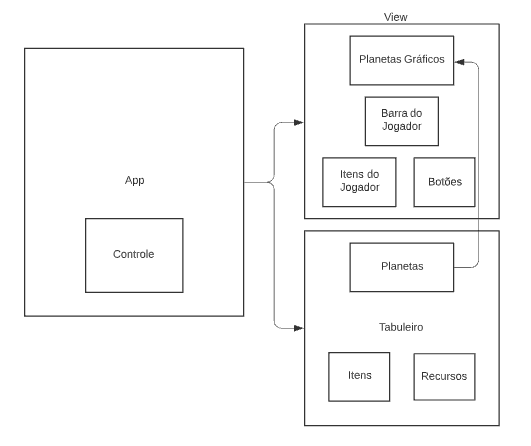

> A classe principal App instancia as classes "Controle", "View" e "Tabuleiro". Cada uma dessas classes é responsável por instanciar os itens que a contem.
> A View cria o contexto com a interface Gráfica e o Tabuleiro cria os planetas com seus respectivos itens.
> O App faz uma conexão entre o a parte visual do planeta com a a classe "Planeta", para que essa classe atualize diretamente a View quando muda seu estado.
> O controle recebe os comandos da View e os requisita para o tabuleiro e também controla a vez do jogador.

## Diagrama Geral de Componentes

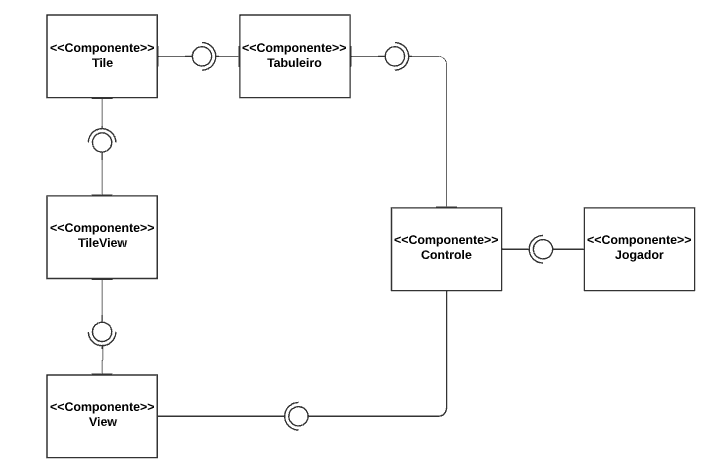

## Componente `Jogador`

>   O Componente Jogador tem como função armazenar a potuação, recursos e itens do jogador
> para que o controle saiba quando o jogo acabou e quais ações são possíveis no turno atual\
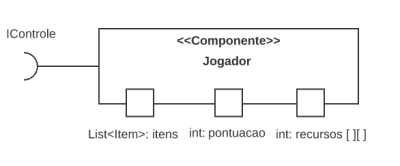

**Ficha Técnica**
item | detalhamento
---- | ------------
Classe | `Tabuleiro.Jogador`
Autores | `Jéssica & Gabriel`
Interfaces | `Ijogador`

### Interfaces

Interfaces associadas a esse componente:

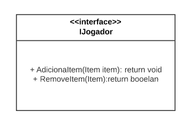

Interface agregadora do componente em Java: 

~~~java
public interface IJogador {
    void AdicionarItem(Item item);
    boolean RemoverItem(Item item);
}
~~~
## Componente `Controle`

>   Esse componente administra o estado do Jogador, atualizando sempre que ocorre alguma mudança de pontos e administrando a vez dos jogadores.
> Ele recebe os comandos do usuário pela interface gráfica e requisita as funções específicas para o tabuleiro caso elas sejam validadas.

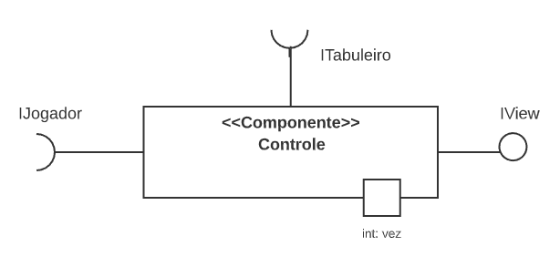

**Ficha Técnica** 
item | detalhamento
----- | -----
Classe | `Tabuleiro.Controle`
Autores | `Jéssica`
Interfaces | `IControle`

### Interfaces

Interfaces associadas a esse componente:

Interface agregadora do componente em Java:

~~~java
public interface IControle {
    boolean Construir(Item item);
    boolean Mover(Item item);
}
~~~
## Componente `Tabuleiro`

>   O Componente Jogador tem como função armazenar a potuação, recursos e itens do jogador
> para que o controle saiba quando o jogo acabou e quais ações são possíveis no turno atual\
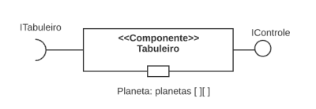

**Ficha Técnica**
item | detalhamento
----- | -----
Classe | `Tabuleiro.Tabuleiro`
Autores | `Jéssica & Gabriel`
Interfaces | `ITabuleiro`

### Interfaces

Interfaces associadas a esse componente:

~~~java
public interface ITabuleiro {
    void Mover(int idDestino, int idOrigem, String itemMovido);
    void Construir(int id, String objeto);
}
~~~
## Componente `Tile`

>   Envolve o Planeta, os Itens instanciados em cada Planeta e os recursos disponíveis nos planetas. 
> É ele que insere ou remove itens do planeta. Esse componente também conhece seus vizinhos (outros componentes Tile) e fornece essa informação quando necessário para que o tabuleiro possa validar o movimento.
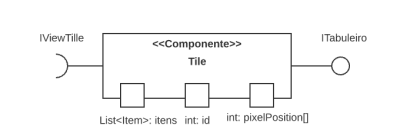

**Ficha Técnica**
item | detalhamento
----- | -----
Classe |  `Tabuleiro.Tile`
Autores | `Jéssica & Gabriel`
Interfaces | `ITile`

### Interfaces

Interfaces associadas a esse componente:

Interface agregadora do componente em Java:

~~~java
public interface ITile {
    boolean isVizinho(int id);
    Item Construir(String objeto);
    Item Remover(String itemRemovido);
    Item Inserir(Item itemInserido);
}
~~~
## Componente `TileView`

>  Esse componente é a interface gŕafica do planeta e seus itens. 
> É atualizado pelo componente Tile toda vez que ele muda seu estado, (desenhando ou excluindo os itens da tela conforme eles se mexem) e também é inicializado pelo Tile.
> O TileView é um botão que requisita ações para View sempre que é clicado.
> 
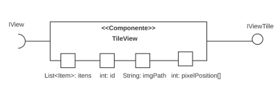

**Ficha Técnica**
item | detalhamento
----- | -----
Classe |  `View.TileView`
Autores | `Jéssica & Gabriel`
Interfaces | `ItileView`

### Interfaces

Interfaces associadas a esse componente:

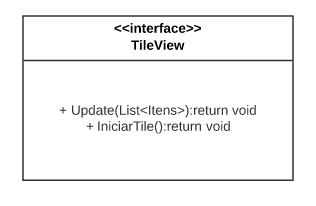

Interface agregadora do componente em Java:

~~~java
public interface ITileView {
    void Update(List<Item> itens);
    void IniciarTile();
}
~~~
## Componente `View`

> Organiza toda a estrutura gráfica do Jogo, mostrando na tela o menu com os materiais e itens dos jogadores, e os botões específicos conforme as regras do jogo.
> 
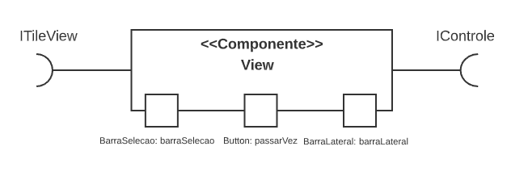

**Ficha Técnica**
item | detalhamento
----- | -----
Classe |  `View`
Autores | `Jéssica & Gabriel`
Interfaces | `IView`

### Interfaces

Interfaces associadas a esse componente:

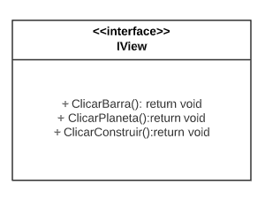

Interface agregadora do componente em Java:

~~~java
public interface IView {
    void ClicarBarra(ActionEvent actionEvent);
    void ClicarPlaneta(ActionEvent actionEvent);
    void ClicarConstruir(ActionEvent actionEvent);
}
~~~
## Detalhamento das Interfaces

### Interface `IItem`

Padronizar e modularizar a comunicação entre as classes Item e Planeta

~~~java
public interface IItem {
    public static List<Recursos> coletados = new ArrayList<Recursos>();
    // acoes de jogo
    int lutar();
    void  recolherRecurso(Recursos coletado);
    // getters e setters
    List<Integer> getPosition();
    List<Recursos> getColetados();
    String getType();
    String getImgPath();
}

~~~

Método | Objetivo
-------| --------
`lutar` | Retorna um int que quando comparado com o valor fornecido por outro item determina quem ganhou a luta.
`recolherRecurso` | !!um pequeno problema!!Recebe um objeto da classe Recursos e adiciona ao atributo estático coletados que armazena todos os recursos coletados pelo jogador .
`getPosition`| Retorna uma lista no formato [i,j] que representa a qual planeta da matriz o item pertence 
`getColetados`|retorna uma lista de recursos coletados pelos itens
`getType` | Retorna uma string informando o nome da classe.
`getImgpath` | Retorna uma string com o caminho para o arquivo da imagem para o item
`.

# Plano de Exceções

## Diagrama da hierarquia de exceções
`<Elabore um diagrama com a hierarquia de exceções como detalhado abaixo>`

## Descrição das classes de exceção

`<Monte uma tabela descritiva seguindo o exemplo>:`

Classe | Descrição
----- | -----
InvalidImgPath | Engloba todos os erros de caminho para imagens
InvalidItemIcon | indica erro no caminho de uma imagem de um item
InvalidPLanetIcon |indica erro no caminho de uma imagem de um planeta
InvalidMovement | Engloba movimentos invalidos
MovementOutOfReach | indica que o planeta de destino é invalido
MovementBLockedByNaveColonizadora | indica que o planeta de destino está bloquado por outra nave colonizadora
ItemAlreadyMoved | Indica que a peça já foi movimentada
UnableToBuild | Engloba erros de Construção
NotEnoughRecursos | Indica que o jogador nao possui recursos suficientes
NotEnoughSpace | Indica que não há espaço suficiente no planeta para construir mais itens 

