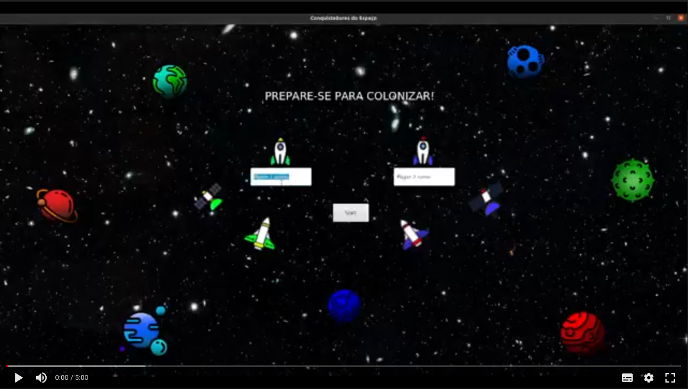

# Projeto `Colonizadores Espaciais`

# Descrição Resumida do Jogo
O jogo é formado por um tabuleiro com 16 planetas e é jogado por duas pessoas.
Existem os itens: nave de guerra, nave colonizadora e satélite e os recursos: metal,
munição e combustível.
O jogo começa com cada jogador em um planeta aleatório, com uma nave colonizadora e
um satélite nele.
A cada rodada, os jogadores têm sua vez e podem optar por se mover para um planeta ou
construir um item (se tiver recursos disponíveis). Se se moverem para um planeta com nave
inimiga, haverá uma luta, sendo a ordem de força satélite>nave de guerra> nave
colonizadora respeitada. Após as jogadas, é sorteado dois planetas, que oferecem os
recursos que possuem para o jogador que está nele. Quanto mais planeta o jogador
colonizar, mais chances tem de ganhar mais recursos.
Ganha o jogador que fizer 12 pontos primeiro (cada item construído
# Equipe
* `Jéssica  Da Silva De Oliveira` - `RA173931`
* `Gabriel Lima Luz` - `RA177836`

# Vídeos do Projeto

## Vídeo da Prévia

## Vídeo do Jogo

# Slides do Projeto

## Slides da Prévia
[`Slides`](mediasDoProjeto/ColonizadoresEspaciaisSlides.pdf)

## Slides da Apresentação Final
[Slide Final](https://docs.google.com/presentation/d/11qTxp_TWNRNH8hJwHmlFnG_UQ2e56wFU4XpdZa-8dr0/edit?usp=sharing)

## Relatório de Evolução

> A maior dificuldade encontrada foi pensar em uma arquitetura para o projeto que envolvesse a interface gráfica, pois não tínhamos conhecimento de como ela funcionava e não sabíamos como montar seu planejamento.
> Inicialmente havia uma única classe View, que se comunicava com o Controlador, o que gerava problemas. Pois o controlador atualizava diretamente a View, ao mesmo tempo e que recebia requisoções dela.
> Com a evolução do projeto, fizemos um componente View para cada componente que tivesse uma interface visual. Desse modo, conseguimos aplicar o pattern Observer para que o componente modelo notificasse a view sempre que houvesse uma mudança.
> Com isso, o controlador, passou a se preocupar em notificar somente o tabuleiro sobre requisões do usuário e o próprio tabuleiro e componentes atualizavam a view.

> Esse é o diagrama geral e de componentes antigos, a versão atualizada será mostrada adiante

> Algo que ficou evidente com o final do projeto, foi a importância da arquitetura e de fazer um bom planejamento. Por falta de conhecimento, não conseguimos fazer isso logo de início e atrapalhou muito o desenvolvimento, pois tivemos que mudar várias vezes durante a contrução do projeto.

# Destaques de Código

## Uso de Herança para metodos nos itens:
> O uso da herança permitiu implementar os metodos mais gerais dos itens apenas uma vez, assim reduzindo a possibilidade de erros e facilitando a refatoração e solução de erros
~~~ java
// src.itens.item.java
public void recolherRecurso(Recursos coletado) {
        coletado.setDono(this.representacao);
        coletados.add(coletado);
        }

public String getImgPath(){
        /**
         *  retorna o cominho que contem a imagem pra esse item
         */
        String imgPath;
        imgPath = "images/"+this.getType()+this.representacao+".png";
        return imgPath;
        }
~~~

## Uso de Polimorfismo para implementar versões diferentes do lutar nos itens:
> O uso do Polimorfismo facilitou na padroinização e encapsulamento do metodo lutar para as subclasses da classe Item
~~~ java
    //src.itens.Item    
    @Override
        public int lutar() {
            Random gerador = new Random();
            return gerador.ints(1,0,6).toArray()[0];
        }
~~~
~~~ java
    //src.itens.NaveGuerra
    @Override
    public int lutar(){
        Random gerador = new Random();
        int[] result = gerador.ints(2,0,6).toArray();
        int max = 0;
        for( int i = 0; i<result.length; i ++){
            if( max < result[i]){
                max = result[i];
            }
        }
        return max;
    }
~~~
~~~ java
    //src.itens.Satelite
    @Override
    public int lutar(){

        Random gerador = new Random();
        int[] result =  gerador.ints(3,0,6).toArray();
        int max = 0;
        for(int i = 0; i<result.length; i++){
            max = result[i];
        }
        return max;
    }
~~~

## Uso de multithreading 

> Uma simples aplicação de multithreading para alterar a view sem que a interação do player seja prejudicada 

~~~ java
    //src.View.Tile

    public void showHighLight(String highLightPath, int x, int y){
        ImageView fundo = new ImageView(new Image(highLightPath));
        fundo.setX(x);
        fundo.setY(y);
        this.getChildren().add(fundo);
        fundo.toBack();
        Task<Void> sleeper = new Task<Void>() {
            @Override
            protected Void call() throws Exception {
                try {
                    Thread.sleep(2000);

                }catch (InterruptedException e){

                }return null;
            }
        };
        sleeper.setOnSucceeded(new EventHandler<WorkerStateEvent>() {
            @Override
            public void handle(WorkerStateEvent workerStateEvent) {
                getChildren().remove(fundo);
            }
        });
        new Thread(sleeper).start();
    }
~~~

## Uso de Atributos para associar classes e as imagens dos icones

> Foi utilizado um padrão para nomear os arquivos de modo que fosse possivel que cada planeta tivesse sua imagem escolhida aleatoriamente,dando um visual mais dinamico no tabuleiro 

~~~ java
    //src.Tabuleiro.Planeta
    
    public Planeta(int i, int j, int ipixels, int jpixels, int id, String  type) {
        support = new PropertyChangeSupport(this);
        this.i = i;
        this.j = j;
        this.ipixels = ipixels;
        this.jpixels = jpixels;
        this.id = id;
        //this.idVizinhos = idVizinhos;
        this.type = type;
        int imgNumber = new Random().nextInt(2);
        this.imgpath = "images/planeta"+type+ imgNumber;
    }
~~

# Destaques de Pattern
`Adotamos o Pattern observer`

## Diagrama do Pattern

## Código do Pattern

> A classe planeta contém os itens (naves e satélites) e a classe Tile engloba a representação visual do planeta e os itens que ele possui.
> O Tile é um observer do Planeta. Toda vez que um item é adicionado ou removido do planeta, o Planeta notifica automaticamente o Tile, que resedenha seu espaço com os novos itens.
> Quando um planeta é sorteado e gera recurso, a classe Planeta também notifica o Tile, que realiza uma mudança visual para que o usuário veja que aquele planeta foi sorteado.

~~~java
//Planeta notifica Tile
@Override
public boolean Inserir(Item item) {
        if(AvaliarSituacaoIntruso(item)==0){
        List<Item> itensAnteriores = new ArrayList<>();
        itensAnteriores.addAll(itens);
        this.itens.add(item);
        support.firePropertyChange("itens",itensAnteriores,itens);
        return true;
        }
        return false;
        }
        
//Tile Recebe notificações
@Override
public void propertyChange(PropertyChangeEvent propertyChangeEvent) {
        if(propertyChangeEvent.getPropertyName().equals("sorteado")){
        this.showHighLight("images/highlight.png", 12, 10);
        } else if(propertyChangeEvent.getPropertyName().equals("itens")){
        update((List<Item>) propertyChangeEvent.getNewValue());
        }
        }
~~~

> O componente Jogador apresenta o estado do jogador, com sua pontuação, itens e recursos disponíveis. Esse componente sabe, por exemplo, se o jogador já moveu todos os seus itens na rodada, se é a sua vez de jogar. 
> Conforme essas informações, ele atualiza o componente JogadorGrafico, que as mostra na tela conforme notificado.

~~~java
//Jogador notifica a parte gráfica quando perde um item
public void ExcluirItem(Object[] object){
int statusAnterior[] = status();
int pontuacaoAnterior = pontuacao;
for(int i = 1; i<object.length;i++){
itens.remove(object[i]);
if(object[i] instanceof NaveColonizadora){
pontuacao-=1;
} else if(object[i] instanceof NaveGuerra){
pontuacao-=2;
} else {
pontuacao-=3;
}
}
support.firePropertyChange("status",statusAnterior,status());
support.firePropertyChange("pontuacao",pontuacaoAnterior, pontuacao);
}

//Parte gráfica recebe notificação
@Override
public void propertyChange(PropertyChangeEvent propertyChangeEvent) {
        if(propertyChangeEvent.getPropertyName().equals("pontuacao")){
        update((int) propertyChangeEvent.getNewValue());
        } else if (propertyChangeEvent.getPropertyName().equals("status")){
        int status[] = (int[]) propertyChangeEvent.getNewValue();
        barraLateral.update(status);
        }
        ....
}
~~~ 

> Aplicamos esse Pattern usando o "PropertyChangeSupport" do Java beans. Com isso, o controle não atualizava mais a View e só se preocupava com a lógica do jogo. Além disso, nesse modelo podemos modificar completamente a view, sem afetar o funcionamento do jogo, administrado pelo controle e pelas classes "modelo".

# Conclusões e Trabalhos Futuros

## Patterns futuros

> Um dos patterns futuros que poderia ser implementado seria o singleton para garantir que não haja duplicação de itens ou recursos no jogo
>. Alem disso uso do pattern obsever poderia ser ampliado para facilitar a atualização de partes da interface gráfica
## Melhorias Futuras 
> Uma melhoria que poderia ser implementada é um componente Montador. No início do jogo, parecia que não havia necessidade de usá-lo, mas conforme o jogo cresceu, esse componente poderia ser usado pelo controlador para construir o jogo e conectar observers com seus obsevebles, retornando um jogo pronto para o controle.
> Expandir o uso de multithreading na interface grafica pode ser bastante vantajoso para o projeto 
> Outra melhoria possivel é o uso de vetores para armazenar as intâncias dos jogadores no controle ,o que iria possibilitar ampliar os numeros de jogadores. Isso abre espaço para varias novas mecânicas de jogo como troca entre jogadores, ampliação do tamanho do tabuleiro e numero de planetas , cartas de objetivo como por exemplo o jogador com maior frota de naves ganha ponto ou o jogador com mais planetas do mesmo tipo ganha um ponto extra.  
> Um modo online é algo que o grupo gostaria muito que fosse implementado, utilizando banco de dados e sockets para permitir que o jogo possa ter um multiplayer online .

# Documentação dos Componentes

# Diagramas

## Diagrama Geral do Projeto

> A classe principal App instancia o Controle. Esse componente instancia o Tabuleiro (que cria seus itens e recursos conforme regras do jogo) e as respectivas partes gráficas dos componentes.
> Ele conecta os componentes com suas partes gráficas e inicia o jogo, coordenando as vezes do jogador e recebendo ações das views e passando para o Tabuleiro, que as administra os itens entre os planetas e valida ações ou requisita ações dos planetas.

## Diagrama Geral de Componentes

## Componente `Jogador`

>   O Componente Jogador tem como função armazenar a potuação, recursos e itens do jogador e também saber se todos os seus itens foram removidos ou se é a sua vez de jogar.
> para que o controle saiba quando o jogo acabou e quais ações são possíveis no turno atual.

**Ficha Técnica**
item | detalhamento
---- | ------------
Classe | `Tabuleiro.Jogador`
Autores | `Jéssica & Gabriel`
Interfaces | `Ijogador`

### Interfaces

Interfaces associadas a esse componente:

Interface agregadora do componente em Java: 

~~~java
public interface IJogador {
    void setItem(Item item);
    void setPontuacao(int pontuacao);
    int getPontuacao();
    void updateRecursos();
    int getQtdItens();
    void IniciarJogador();
    void setNome(String nome);
}
~~~

## Detalhamento da Interface

### Interface `IJogador`

`A interface contém métodos necessários para que o controle obtenha as informações que precisa para saber, por exemplo, se o jogo ainda continua, se o jogador já moveu todos os itens, se o jogador tem recursos suficientes para construir itens.`

Método | Objetivo
----- | -----
`setItem`| `atualiza os itens iniciais do jogador quando o jogo começa`
`setPontuacao` | `atualiza a pontuação inicial do jogador quando o jogo começa`
`getPontuacao` | `retorna a pontuação atual do jogador para o Controle`
`updateRecursos` | `atualiza todos os recursos do jogador com base nos recursos que seus itens armazenam`
`getQtdItens` | `retorna a quantidade de itens que o jogador possui`
`setNome` | `atualiza o nome do jogador quando digitado pelo usuário`
`IniciarJogador` | `jogador inicia o jogador gráfico para que apareça na tela suas informações iniciais atualizadas`

### Interface `ITrocarVez`

`A interface é compartlhada por mais de um componente. É necessária para os componentes que precisam agir conforme turno do jogo`

Método | Objetivo
----- | -----
`TrocarVez`| `atualiza o jogador para trocar a vez do seu estado atual`

## Componente `Controle`

>   Esse componente administra o estado do Jogador, atualizando sempre que ocorre alguma mudança de pontos e administrando a vez dos jogadores.
> Ele recebe os comandos do usuário pela interface gráfica e requisita as funções específicas para o tabuleiro caso elas sejam validadas.

**Ficha Técnica** 
item | detalhamento
----- | -----
Classe | `View.Controle`
Autores | `Jéssica`
Interfaces | `IControle`

### Interfaces

Interfaces associadas a esse componente:

Interface agregadora do componente em Java:

~~~java
public interface IControle extends ITrocarVez {
    boolean Mover(int planetaClicado, int planetaRecebeAcao, String objeto);
    int getVez();
    boolean Construir(int id, String objeto);
}
~~~
## Detalhamento da Interface

### Interface `IControle`

`A interface contém os métodos que a view precisa requisitar ao controle conforme ação do jogador`

Método | Objetivo
----- | -----
`Mover`| `recebe o id dos planetas clicados e o nome do objeto a ser movido, requisita o movimento ao tabuleiro e retorna a resposta dele`
`getVez` | `retorna a vez do jogador para que a interface gráfica saiba quais elementos mostrar`
`Construir` | `retorna a pontuação atual do jogador para o Controle`

### Interface `ITrocarVez`

`A interface é compartlhada por mais de um componente. É necessária para os componentes que precisam agir conforme turno do jogo`

~~~java
public interface ITrocarVez {
    void TrocarVez();
}
~~~

Método | Objetivo
----- | -----
`TrocarVez`| `requisitado pela interface gráfica quando usário quer passar sua vez e é usado pelo controle para coordenar turnos`
        
## Componente `Tabuleiro`

> O componente contém uma matriz com todos os planetas. Ele instancia os planetas e os itens iniciais de cada planeta. Éle quem administra o movimento dos itens pelos planetas, requisitando para o planeta inserção, remoção de itens, recursos novos.
> Realiza esses movimento quando o controle requisita sua ação.
> 

**Ficha Técnica**
item | detalhamento
----- | -----
Classe | `Tabuleiro.Tabuleiro`
Autores | `Jéssica & Gabriel`
Interfaces | `ITabuleiro`

### Interfaces

Interfaces associadas a esse componente:

Interface agregadora em java

~~~java
public interface ITabuleiro extends IGerarRecurso, IConstruir {
    public Object[] Mover(int idDestino, int idOrigem, String itemMovidoTexto) throws RuntimeException;
}
~~~

Método | Objetivo
----- | -----
`Mover`| `recebe os planetas de origem e destino e o nome do item a ser movido, faz as verificações nos planetas e insere e remove o item deles`

## Detalhamento da Interface

### Interface `IConstruir`

`Contem o método construir que é compartilhado por mais de uma interface do jogo.`

~~~java
public interface IConstruir {
    Item Construir(int id, String objeto);
}
~~~

Método | Objetivo
----- | -----
`Construir`| `recebe id do planeta em que será construído um item e o nome do item, retorna se foi possível construir ou não`

### Interface `IGerarRecurso`

`Contem o método para Gerar Recurso que é compartilhado por mais de uma interface do jogo.public interface IGerarRecurso`

~~~java
public interface IGerarRecurso {
    void GerarRecursos();
}
~~~

Método | Objetivo
----- | -----
`GerarRecursos`| `requisita que a classe que implementa esse método gere recurso, no tabuleiro, esse meodo sorteia dois planetas e requisita que eles gerem recursos`

## Componente `Tile`

>   Engloba o Planeta, os Itens instanciados em cada Planeta e os recursos disponíveis nos planetas. 
> É ele que insere ou remove os itens do planeta. Esse componente também conhece seus vizinhos (outros componentes Tile) e fornece essa informação quando necessário para que o tabuleiro possa validar o movimento.

**Ficha Técnica**
item | detalhamento
----- | -----
Classe |  `Tabuleiro.Tile`
Autores | `Jéssica & Gabriel`
Interfaces | `IPlaneta`

### Interfaces

Interfaces associadas a esse componente:

Interface agregadora do componente em Java:

~~~java
public interface IPlaneta extends IGerarRecurso, IConstruir {
    void Remover(Item item);
    boolean Inserir(Item item);
    List<Item> getItens();
    boolean  isVizinho(int idVizinho);
}
~~~

Método | Objetivo
----- | -----
`Remover`| `planeta remove o item que está nele`
`Inserir`| `planeta insere o item que recebe`
`getItens`| `planeta retorna os itens que possui`
`isVizinho`| `planeta recebe um id e retorna se o id é de um planeta vizinho a ele ou não`

## Detalhamento da Interface

### Interface `IConstruir`

`Contem o método construir que é compartilhado por mais de uma interface do jogo.`

~~~java
public interface IConstruir {
    Item Construir(int id, String objeto);
}
~~~

Método | Objetivo
----- | -----
`Construir`| `recebe id do planeta em que será construído um item e o nome do item, instancia um novo item e insere no planeta`

### Interface `IGerarRecurso`

`Contem o método para Gerar Recurso que é compartilhado por mais de uma interface do jogo.public interface IGerarRecurso`

~~~java
public interface IGerarRecurso {
    void GerarRecursos();
}
~~~

Método | Objetivo
----- | -----
`GerarRecursos`| `requisita que a classe que implementa esse método gere recurso, no Tile, essa classe instancia um novo recurso e o insere no item que está nele`

## Componente `TileView`

>  Esse componente é a interface gŕafica do planeta e seus itens. 
> É atualizado pelo componente Tile toda vez que ele muda seu estado, (desenhando ou excluindo os itens da tela conforme eles se mexem) e também é inicializado pelo Tile.
> O TileView requisita ações para o controle sempre que é clicado
> 

**Ficha Técnica**
item | detalhamento
----- | -----
Classe |  `View.TileView`
Autores | `Jéssica & Gabriel`
Interfaces | `ITile`

### Interfaces

Interfaces associadas a esse componente:

Interface agregadora do componente em Java:

~~~java
public interface ITile {
    void IniciarTile();
    void update();
    void setPlanetaId(int i);
    void setImgpath(String imgpath);
    void setItens(List<Item> items);
    void setPositionsPixels(int[] positions);
}
~~~

## Detalhamento da Interface

### Interface `ITile`

`Contem os métodos que o Planeta precisa para atualizar e inicializar sua versão gráfica`

Método | Objetivo
----- | -----
`setPlanetaId`| `atualiza o id do planeta que o Tile vai representar`
`setImgPath` | `atualiza a imagem do planeta que o Tile vai representar`
`setItens` | `atualiza os itens que o planeta possui, para que o Tile possa representá-los graficamente`
`setPositionPixels` | `atualiza a posição na tela em que o Tile deve desenhar planetas e itens`
`update` | `redesenha o planeta com seus itens, atualizando a imagem gráfica` 
`IniciarTile` | `desenha as informações iniciais na tela para iniciar o jogo`

## Componente `JogadorGrafico`

>  Representa as informações gráficas do jogador na tela (quantidade de itens, recursos e pontuação). É somente visual, portanto não interage recebendo eventos do usuário.

**Ficha Técnica**
item | detalhamento
----- | -----
Classe |  `View.JogadorGrafico`
Autores | `Jéssica & Gabriel`
Interfaces | `IJogadorGrafico`

### Interfaces

Interfaces associadas a esse componente:

Interface agregadora do componente em Java:

~~~java
public interface IJogadorGrafico {
    void setNome(String nome);
    void update(int pontos);
    vois TrocarVez();
}
~~~

## Detalhamento da Interface

### Interface `IJogadorGrafico`

`Contém métodos que o jogador precisa para atualizar sua interface gráfica`

Método | Objetivo
----- | -----
`setNome`| `atualiza o nome do jogador no início do jogo`
`update` | `atualiza a quantidadede pontos que o jogador tem`

### Interface `ITrocarVez`

`A interface é compartlhada por mais de um componente. É necessária para os componentes que precisam agir conforme turno do jogo`

~~~java
public interface ITrocarVez {
    void TrocarVez();
}
~~~

Método | Objetivo
----- | -----
`TrocarVez`| `requisitado pela interface gráfica quando usário quer passar sua vez e é usado pelo controle para coordenar turnos`

# Plano de Exceções

## Diagrama da hierarquia de exceções

## Descrição das classes de exceção

`<Monte uma tabela descritiva seguindo o exemplo>:`

Classe | Descrição
----- | -----
InvalidImgPath | Engloba todos os erros de caminho para imagens
InvalidItemIcon | indica erro no caminho de uma imagem de um item
InvalidPLanetIcon |indica erro no caminho de uma imagem de um planeta
InvalidMovement | Engloba movimentos invalidos
MovementOutOfReach | indica que o planeta de destino é invalido
MovementBLockedByNaveColonizadora | indica que o planeta de destino está bloquado por outra nave colonizadora
ItemAlreadyMoved | Indica que a peça já foi movimentada
UnableToBuild | Engloba erros de Construção
NotEnoughRecursos | Indica que o jogador nao possui recursos suficientes
NotEnoughSpace | Indica que não há espaço suficiente no planeta para construir mais itens 

